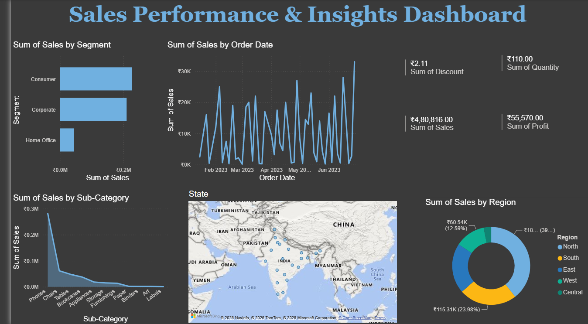

# Sales Performance & Insights Dashboard

## Overview

This project presents a comprehensive analysis of sales performance, profitability, customer segmentation, and regional trends based on order transaction data.

The interactive Power BI dashboard provides a consolidated view of key business metrics and helps identify sales trends, regional performance, customer segment contribution, and product-level performance.

## Key Performance Indicators (KPIs)

- **Total Sales:** ₹4,80,816.00
- **Total Profit:** ₹55,570.00
- **Total Quantity Sold:** 110 units
- **Discount:** ₹2.11

## Dashboard Insights & Breakdown

### 1. Sales by Customer Segment

- **Consumer:** Dominates total sales revenue and represents the primary revenue-generating segment.
- **Corporate:** Represents the second-largest customer segment with consistent demand.
- **Home Office:** Represents a smaller share of sales and may provide an opportunity for targeted growth initiatives.

### 2. Product Category & Sub-Category Performance

- **Phones & Chairs:** Among the leading sub-categories in sales performance.
- **Tables & Bookcases:** Generate substantial sales and can be evaluated further for profitability.
- **Storage, Furnishings, Paper, Binders, Art, & Labels:** Contribute additional sales volume across the product portfolio.

### 3. Regional Sales Distribution

- **West:** Leads regional sales with ₹1,15,310 (23.98%).
- **Central:** Contributes ₹60,540 (12.59%) of overall revenue.
- **North, South, & East:** Contribute the remaining share of regional sales.

### 4. Sales Trends Over Time

Transaction data from February 2023 to June 2023 shows periodic fluctuations in sales.

The dashboard highlights notable sales activity during late May 2023 and mid-June 2023, providing opportunities to investigate seasonal demand and promotional effects.

## Dashboard Preview



## Technical Stack & Tools Used

- **Business Intelligence:** Power BI
- **Data Processing:** Microsoft Excel
- **Data Analysis:** Power BI / DAX
- **Visualizations:** Bar Charts, Line Charts, Donut Charts, Map Visualizations, KPI Cards

## Data Sources

- `customer_orders.xlsx`
- `orders_detail.xlsx`

## Repository Structure

```text
Sales-Performance-PowerBI/
│
├── customer_orders.xlsx
├── orders_detail.xlsx
├── Sales Performance Report.pdf
├── Dashboard.png.png
└── README.md
